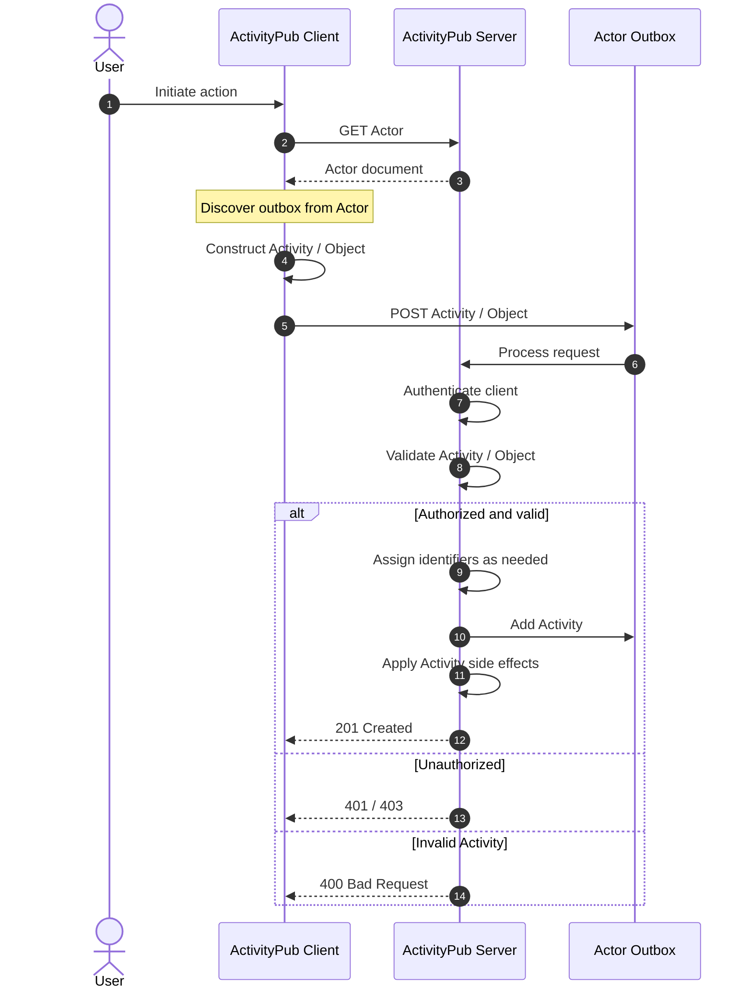
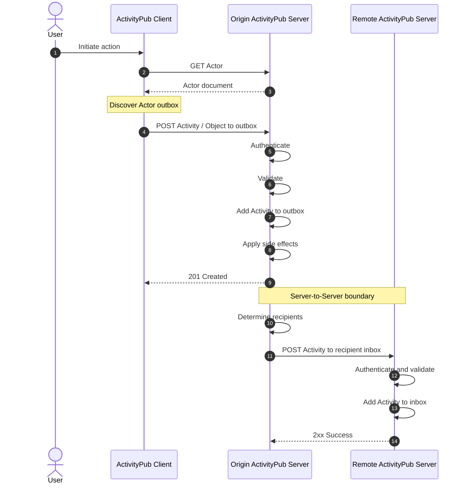

# ActivityPub Client to Server Interaction (Local)

```mermaid
sequenceDiagram
    autonumber

    actor User
    participant Client as ActivityPub Client
    participant Server as ActivityPub Server
    participant Outbox as Actor Outbox

    User->>Client: Initiate action
    Client->>Server: GET Actor
    Server-->>Client: Actor document

    Note over Client: Discover outbox from Actor

    Client->>Client: Construct Activity / Object
    Client->>Outbox: POST Activity / Object

    Outbox->>Server: Process request
    Server->>Server: Authenticate client
    Server->>Server: Validate Activity / Object

    alt Authorized and valid
        Server->>Server: Assign identifiers as needed
        Server->>Outbox: Add Activity
        Server->>Server: Apply Activity side effects
        Server-->>Client: 201 Created
    else Unauthorized
        Server-->>Client: 401 / 403
    else Invalid Activity
        Server-->>Client: 400 Bad Request
    end

```

# ActivityPub Client To Server Interaction (Federated)

```mermaid
sequenceDiagram
    autonumber

    actor User
    participant Client as ActivityPub Client
    participant Origin as Origin ActivityPub Server
    participant Remote as Remote ActivityPub Server

    User->>Client: Initiate action
    Client->>Origin: GET Actor
    Origin-->>Client: Actor document

    Note over Client: Discover Actor outbox

    Client->>Origin: POST Activity / Object to outbox
    Origin->>Origin: Authenticate
    Origin->>Origin: Validate
    Origin->>Origin: Add Activity to outbox
    Origin->>Origin: Apply side effects
    Origin-->>Client: 201 Created

    Note over Origin,Remote: Server-to-Server boundary

    Origin->>Origin: Determine recipients
    Origin->>Remote: POST Activity to recipient inbox
    Remote->>Remote: Authenticate and validate
    Remote->>Remote: Add Activity to inbox
    Remote-->>Origin: 2xx Success
```
