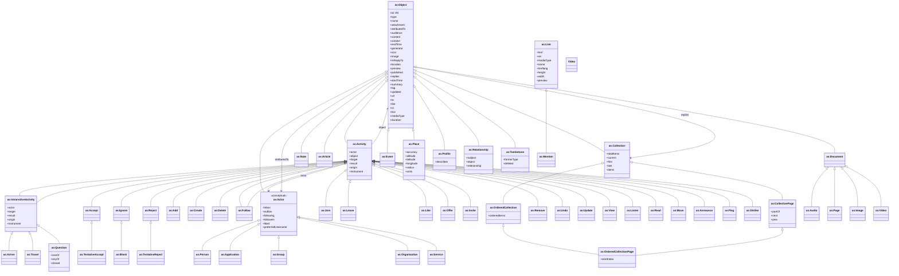

```mermaid

classDiagram
    direction TB

    

    class `as:Object` {
        +id: IRI
        +type
        +name
        +attachment
        +attributedTo
        +audience
        +content
        +context
        +endTime
        +generator
        +icon
        +image
        +inReplyTo
        +location
        +preview
        +published
        +replies
        +startTime
        +summary
        +tag
        +updated
        +url
        +to
        +bto
        +cc
        +bcc
        +mediaType
        +duration
        
    }
    
     class `as:Link` {
        +href
        +rel
        +mediaType
        +name
        +hreflang
        +height
        +width
        +preview
    }

    class `as:Activity` {
        +actor
        +object
        +target
        +result
        +origin
        +instrument
    }

    class `as:IntransitiveActivity` {
        +actor
        +target
        +result
        +origin
        +instrument
    }

    `as:Activity` <|-- `as:IntransitiveActivity`

    class `as:Collection` {
        +totalItems
        +current
        +first
        +last
        +items
    }

    class `as:OrderedCollection` {
       +orderedItems
    }

    class `as:CollectionPage` {
        +partOf
        +next
        +prev
    }

    class `as:OrderedCollectionPage` {
        +startIndex
    }


  

    class `as:Accept` 
    `as:Activity` <|-- `as:Accept` 
    class `as:TentativeAccept`
    `as:Accept` <|-- `as:TentativeAccept` 
     class `as:Add`
     `as:Activity` <|-- `as:Add`
     class `as:Arrive` 
     `as:IntransitiveActivity` <|-- `as:Arrive`
     class `as:Create`
     `as:Activity` <|-- `as:Create`
     class `as:Delete`
     `as:Activity` <|-- `as:Delete`
    class `as:Follow`
     `as:Activity` <|-- `as:Follow`
     class `as:Follow`
     `as:Activity` <|-- `as:Follow`
     class `as:Ignore`
     `as:Activity` <|-- `as:Ignore`
    class `as:Join`
     `as:Activity` <|-- `as:Join`
    class `as:Leave`
     `as:Activity` <|-- `as:Leave`
     class `as:Like`
     `as:Activity` <|-- `as:Like`
    class `as:Offer`
     `as:Activity` <|-- `as:Offer`
     class `as:Invite`
     `as:Activity` <|-- `as:Invite`
    class `as:Reject`
     `as:Activity` <|-- `as:Reject`
    class `as:TentativeReject`
     `as:Reject` <|-- `as:TentativeReject`
    class `as:Remove`
     `as:Activity` <|-- `as:Remove`
    class `as:Undo`
     `as:Activity` <|-- `as:Undo`
    class `as:Update`
     `as:Activity` <|-- `as:Update`
    class `as:View`
     `as:Activity` <|-- `as:View`
     class `as:Listen`
     `as:Activity` <|-- `as:Listen`
     class `as:Read`
     `as:Activity` <|-- `as:Read`
    class `as:Move`
     `as:Activity` <|-- `as:Move`
    class `as:Travel`
     `as:IntransitiveActivity` <|-- `as:Travel`
     class `as:Announce`
     `as:Activity` <|-- `as:Announce`
    class `as:Block`
     `as:Ignore` <|-- `as:Block`
    class `as:Flag`
     `as:Activity` <|-- `as:Flag`
     class `as:Dislike`
     `as:Activity` <|-- `as:Dislike`
     class `as:Question` {
        +oneOf
        +anyOf
        +closed
     }
     `as:IntransitiveActivity` <|-- `as:Question`
     
      

    %% Actor Types

    class `as:Actor` {
        <<conceptual>>
        +inbox
        +outbox
        +following
        +followers
        +liked
        +preferredUsername
    }

    class `as:Person`
    class `as:Application`
    class `as:Group`
    class `as:Organization`
    class `as:Service`

    %% Object Types
    class `as:Note`
    class `as:Article` 
    class `as:Audio`
    class `as:Page`
    class Video
    class `as:Document`
    class `as:Image`
    class `as:Video`
    class `as:Event`
    class `as:Place` {
        +accuracy
        +altitude
        +latitude
        +longitude
        +radius
        +units
    }
    class `as:Profile` {
        +describes
    }
    class `as:Relationship` {
        +subject
        +object
        +relationship
    }
    class `as:Tombstone` {
        +formerType
        +deleted
    }

    %% Link Types
    class `as:Mention` 

    `as:Object` <|-- `as:Activity`
    `as:Activity` <|-- `as:IntransitiveActivity`
    `as:Object` <|-- `as:Collection`
    `as:Collection` <|-- `as:OrderedCollection`
    `as:Collection` <|-- `as:CollectionPage`
    `as:OrderedCollection` <|-- `as:OrderedCollectionPage`
    `as:CollectionPage` <|-- `as:OrderedCollectionPage`

    `as:Object` <|-- `as:Actor`
    `as:Actor` <|-- `as:Person`
    `as:Actor` <|-- `as:Application`
    `as:Actor` <|-- `as:Group`
    `as:Actor` <|-- `as:Organization`
    `as:Actor` <|-- `as:Service`

    `as:Object` <|-- `as:Note`
    `as:Object` <|-- `as:Article`
    `as:Object` <|-- `as:Document`
    `as:Document` <|-- `as:Image`
    `as:Document` <|-- `as:Video`
    `as:Document` <|-- `as:Audio`
    `as:Document` <|-- `as:Page`
    `as:Object` <|-- `as:Event`
    `as:Object` <|-- `as:Place`
    `as:Object` <|-- `as:Profile`
    `as:Object` <|-- `as:Relationship`
    `as:Object` <|-- `as:Tombstone`

    `as:Link` <|-- `as:Mention` 

    `as:Activity` --> `as:Object` : object
    `as:Activity` --> `as:Actor` : actor
    `as:Object` --> `as:Actor` : attributedTo
    `as:Object` --> `as:Collection` : replies

```
