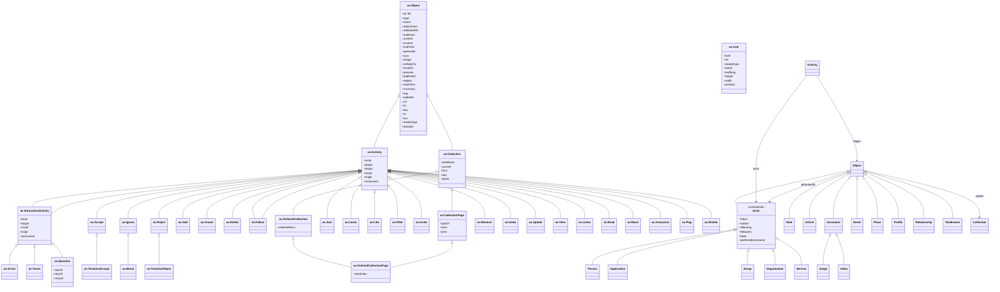

```mermaid

classDiagram
    direction TB

    

    class `as:Object` {
        +id: IRI
        +type
        +name
        +attachment
        +attributedTo
        +audience
        +content
        +context
        +endTime
        +generator
        +icon
        +image
        +inReplyTo
        +location
        +preview
        +published
        +replies
        +startTime
        +summary
        +tag
        +updated
        +url
        +to
        +bto
        +cc
        +bcc
        +mediaType
        +duration
        
    }
    
     class `as:Link` {
        +href
        +rel
        +mediaType
        +name
        +hreflang
        +height
        +width
        +preview
    }

    class `as:Activity` {
        +actor
        +object
        +target
        +result
        +origin
        +instrument
    }

    class `as:IntransitiveActivity` {
        +actor
        +target
        +result
        +origin
        +instrument
    }

    `as:Activity` <|-- `as:IntransitiveActivity`

    class `as:Collection` {
        +totalItems
        +current
        +first
        +last
        +items
    }

    class `as:OrderedCollection` {
       +orderedItems
    }

    class `as:CollectionPage` {
        +partOf
        +next
        +prev
    }

    class `as:OrderedCollectionPage` {
        +startIndex
    }


  

    class `as:Accept` 
    `as:Activity` <|-- `as:Accept` 
    class `as:TentativeAccept`
    `as:Accept` <|-- `as:TentativeAccept` 
     class `as:Add`
     `as:Activity` <|-- `as:Add`
     class `as:Arrive` 
     `as:IntransitiveActivity` <|-- `as:Arrive`
     class `as:Create`
     `as:Activity` <|-- `as:Create`
     class `as:Delete`
     `as:Activity` <|-- `as:Delete`
    class `as:Follow`
     `as:Activity` <|-- `as:Follow`
     class `as:Follow`
     `as:Activity` <|-- `as:Follow`
     class `as:Ignore`
     `as:Activity` <|-- `as:Ignore`
    class `as:Join`
     `as:Activity` <|-- `as:Join`
    class `as:Leave`
     `as:Activity` <|-- `as:Leave`
     class `as:Like`
     `as:Activity` <|-- `as:Like`
    class `as:Offer`
     `as:Activity` <|-- `as:Offer`
     class `as:Invite`
     `as:Activity` <|-- `as:Invite`
    class `as:Reject`
     `as:Activity` <|-- `as:Reject`
    class `as:TentativeReject`
     `as:Reject` <|-- `as:TentativeReject`
    class `as:Remove`
     `as:Activity` <|-- `as:Remove`
    class `as:Undo`
     `as:Activity` <|-- `as:Undo`
    class `as:Update`
     `as:Activity` <|-- `as:Update`
    class `as:View`
     `as:Activity` <|-- `as:View`
     class `as:Listen`
     `as:Activity` <|-- `as:Listen`
     class `as:Read`
     `as:Activity` <|-- `as:Read`
    class `as:Move`
     `as:Activity` <|-- `as:Move`
    class `as:Travel`
     `as:IntransitiveActivity` <|-- `as:Travel`
     class `as:Announce`
     `as:Activity` <|-- `as:Announce`
    class `as:Block`
     `as:Ignore` <|-- `as:Block`
    class `as:Flag`
     `as:Activity` <|-- `as:Flag`
     class `as:Dislike`
     `as:Activity` <|-- `as:Dislike`
     class `as:Question` {
        +oneOf
        +anyOf
        +closed
     }
     `as:IntransitiveActivity` <|-- `as:Question`
     
      

    class Actor {
        <<conceptual>>
        +inbox
        +outbox
        +following
        +followers
        +liked
        +preferredUsername
    }

    class Person
    class Application
    class Group
    class Organization
    class Service

    class Note
    class Article
    class Document
    class Image
    class Video
    class Event
    class Place
    class Profile
    class Relationship
    class Tombstone

    `as:Object` <|-- `as:Activity`
    `as:Activity` <|-- `as:IntransitiveActivity`
    `as:Object` <|-- `as:Collection`
    `as:Collection` <|-- `as:OrderedCollection`
    `as:Collection` <|-- `as:CollectionPage`
    `as:OrderedCollection` <|-- `as:OrderedCollectionPage`
    `as:CollectionPage` <|-- `as:OrderedCollectionPage`

    Object <|-- Actor
    Actor <|-- Person
    Actor <|-- Application
    Actor <|-- Group
    Actor <|-- Organization
    Actor <|-- Service

    Object <|-- Note
    Object <|-- Article
    Object <|-- Document
    Document <|-- Image
    Document <|-- Video
    Object <|-- Event
    Object <|-- Place
    Object <|-- Profile
    Object <|-- Relationship
    Object <|-- Tombstone

    Activity --> Object : object
    Activity --> Actor : actor
    Object --> Actor : attributedTo
    Object --> Collection : replies

```
