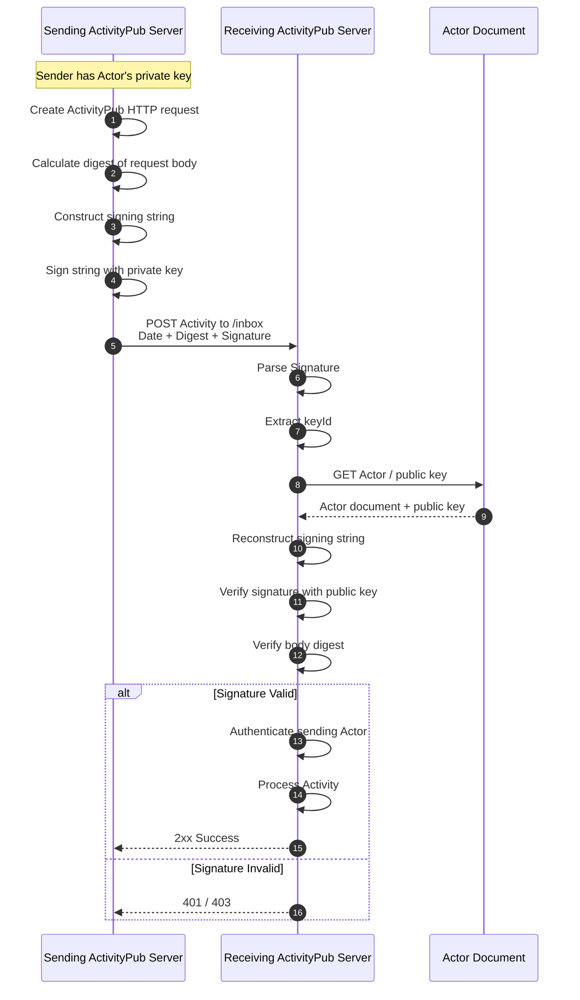

```mermaid


sequenceDiagram
    autonumber

    participant A as Sending ActivityPub Server
    participant B as Receiving ActivityPub Server
    participant D as Actor Document

    Note over A: Sender has Actor's private key

    A->>A: Create ActivityPub HTTP request
    A->>A: Calculate digest of request body
    A->>A: Construct signing string
    A->>A: Sign string with private key

    A->>B: POST Activity to /inbox<br/>Date + Digest + Signature

    B->>B: Parse Signature
    B->>B: Extract keyId

    B->>D: GET Actor / public key
    D-->>B: Actor document + public key

    B->>B: Reconstruct signing string
    B->>B: Verify signature with public key
    B->>B: Verify body digest

    alt Signature Valid
        B->>B: Authenticate sending Actor
        B->>B: Process Activity
        B-->>A: 2xx Success
    else Signature Invalid
        B-->>A: 401 / 403
    end
```

