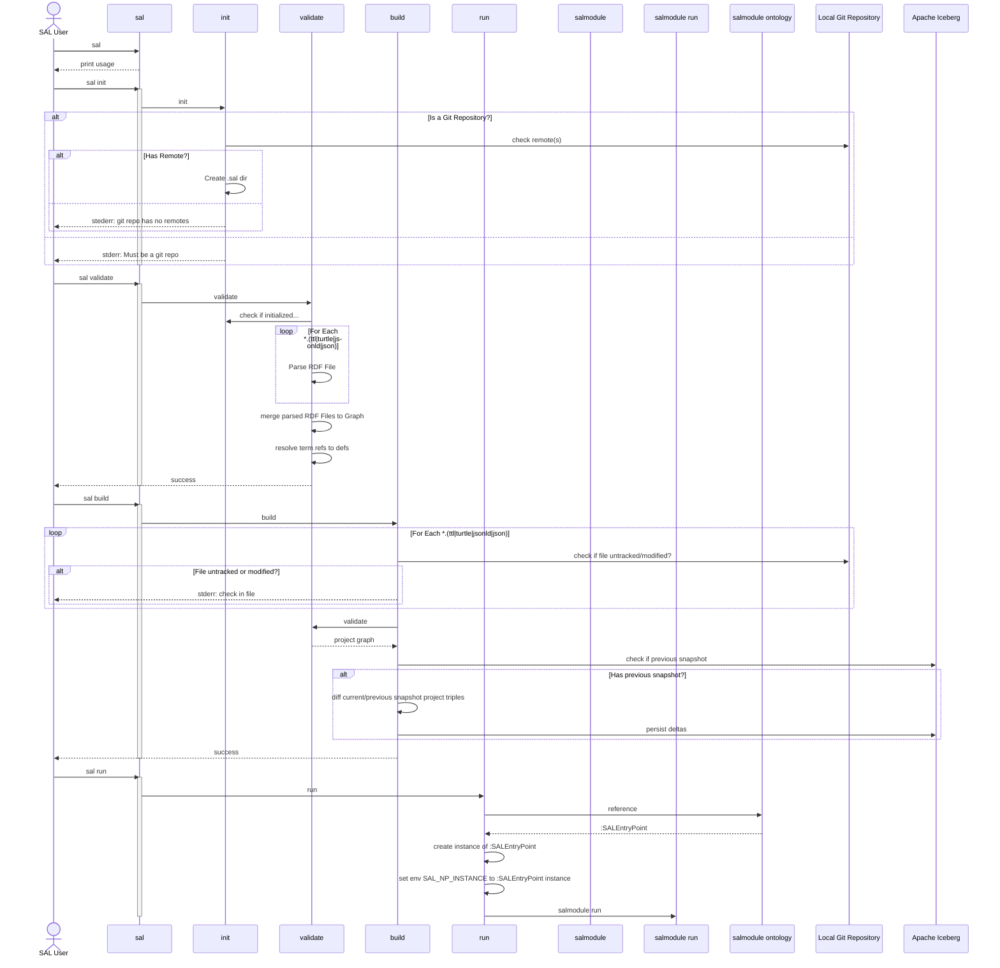

# Overview

SAL command activity diagram

## activity diagram

```mermaid
sequenceDiagram

actor salUser as SAL User
participant salCli as sal
participant initSubCmd as init
participant validateSubCmd as validate
participant buildSubCmd as build
participant runSubCmd as run
participant salmoduleSubCmd as salmodule
participant salmoduleRunSubCmd as salmodule run
participant salmoduleOntologySubCmd as salmodule ontology
participant localGitRepo as Local Git Repository
participant iceberg as Apache Iceberg 
salUser->>salCli: sal
salCli-->>salUser: print usage 

salUser->>salCli: sal init
activate salCli
salCli->>initSubCmd: init
alt Is a Git Repository?
  initSubCmd->>localGitRepo: check remote(s)  
  alt Has Remote?
    
    initSubCmd->>initSubCmd: Create .sal dir   
  else
    initSubCmd-->>salUser: stederr: git repo has no remotes
  end
else
   initSubCmd-->>salUser: stderr: Must be a git repo
end
deactivate salCli

salUser->>salCli: sal validate
activate salCli
salCli->>validateSubCmd: validate
validateSubCmd->>initSubCmd: check if initialized...
loop For Each *.(ttl|turtle|jsonld|json)
  validateSubCmd->>validateSubCmd: Parse RDF File
end
validateSubCmd->>validateSubCmd: merge parsed RDF Files to Graph
validateSubCmd->>validateSubCmd: resolve term refs to defs
validateSubCmd-->>salUser: success
deactivate salCli

salUser->>salCli: sal build
activate salCli
salCli->>buildSubCmd: build
loop For Each *.(ttl|turtle|jsonld|json)
    buildSubCmd->>localGitRepo: check if file untracked/modified? 
    alt File untracked or modified?
        buildSubCmd-->>salUser: stderr: check in file

    end
end
buildSubCmd->>validateSubCmd: validate
validateSubCmd-->>buildSubCmd: project graph
buildSubCmd->>iceberg: check if previous snapshot
alt Has previous snapshot?
   buildSubCmd->>buildSubCmd: diff current/previous snapshot project triples
   buildSubCmd->>iceberg: persist deltas
end
buildSubCmd-->>salUser: success
deactivate salCli


salUser->>salCli: sal run
activate salCli
salCli->>runSubCmd: run
runSubCmd->>salmoduleOntologySubCmd: reference
salmoduleOntologySubCmd-->>runSubCmd: :SALEntryPoint
runSubCmd->>runSubCmd: create instance of :SALEntryPoint
runSubCmd->>runSubCmd: set env SAL_NP_INSTANCE to :SALEntryPoint instance
runSubCmd->>salmoduleRunSubCmd: salmodule run 

deactivate salCli

```