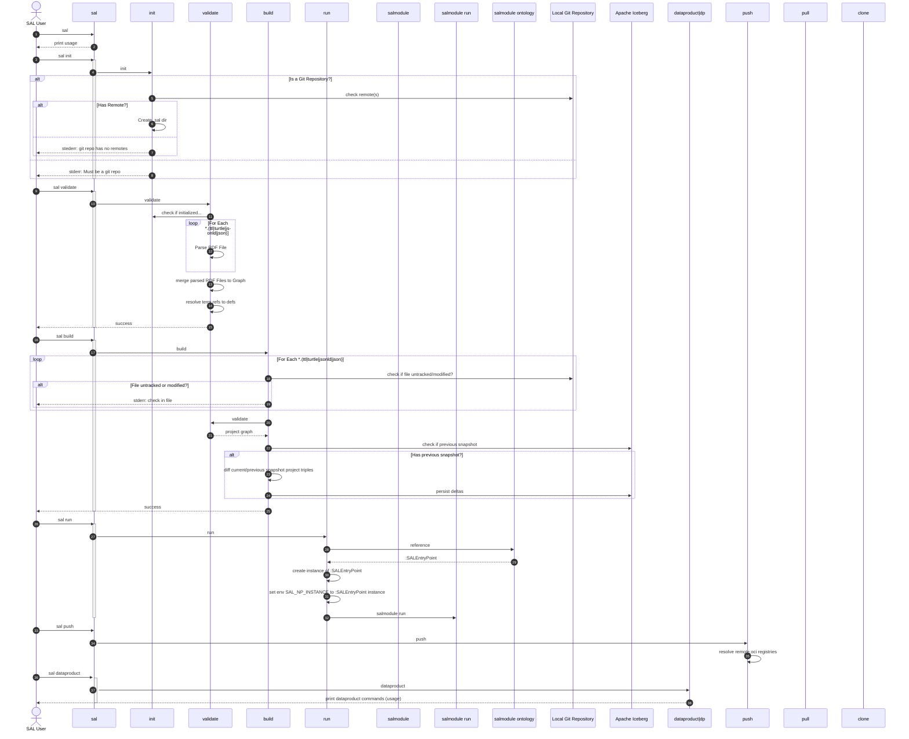

# Overview

SAL command activity diagram

## SAL Commands

*sal init
*sal validate
*sal build
sal clean
*sal run 
sal push
sal pull
sal clone 
*sal dataproduct|dp
sal salmodule ontology
sal salmodule run
sal dataproduct deploy
sal remote add 

## SAL Data Product Development Lifecycle

