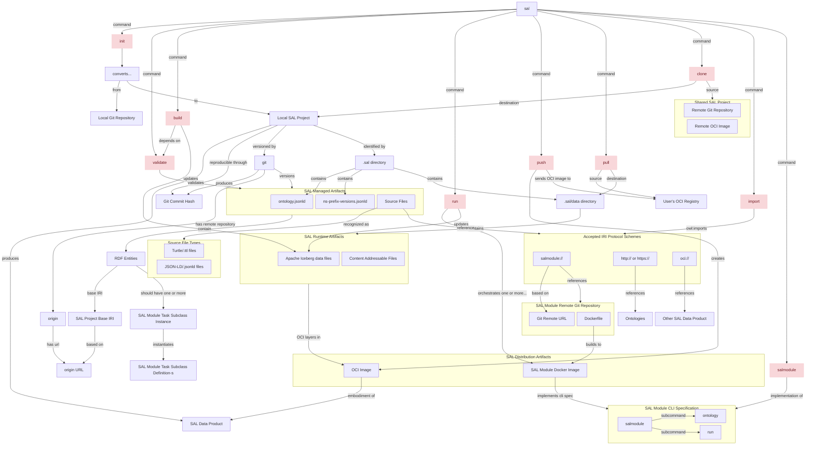

```mermaid
%%{init: { 
  "flowchart": { "nodeSpacing": 10, "rankSpacing": 50 },
  "themeCSS": ".subgraphTitle { padding-bottom: 20px !important; }  }"
} }%%
graph TD
classDef cmd fill:#f8d7da,stroke:#f5c6cb,color:#721c24;
    
    sal -->|command| sal-init-cmd[init]:::cmd
    sal -->|command| sal-validate-cmd[validate]:::cmd
    sal -->|command| sal-build-cmd[build]:::cmd
    sal -->|command| sal-run-cmd[run]:::cmd
    sal -->|command| sal-push-cmd[push]:::cmd
    sal -->|command| sal-pull-cmd[pull]:::cmd
    sal -->|command| sal-clone-cmd[clone]:::cmd
    sal -->|command| sal-import-cmd[import]:::cmd
    sal -->|command| sal-salmodule-cmd[salmodule]:::cmd
    
    

    sal-salmodule-cmd -->|implementation of| salmodule-spec
    sal-import-cmd -->|owl:imports| accepted-proto-schemes
    sal-init-cmd --> converts[converts...]
    converts -->|from| local-git-project[Local Git Repository]
    converts -->|to| local-sal-project[Local SAL Project] 
    sal-push-cmd -->|creates| oci-image
    sal-push-cmd -->|sends OCI image to| user-oci-registry[User's OCI Registry]
    sal-pull-cmd -->|source| user-oci-registry
    sal-pull-cmd -->|destination| dot-sal-data-dir
    sal-clone-cmd -->|source| shared-sal-project
    sal-clone-cmd -->|destination| local-sal-project
    local-sal-project -->|produces| sal-data-product[SAL Data Product]
    dot-sal-dir -->|contains| ontology-jsonld-file[ontology.jsonld]
    dot-sal-dir -->|contains| ns-prefix-version-jsonld-file[ns-prefix-versions.jsonld]
    dot-sal-dir -->|contains| dot-sal-data-dir[.sal/data directory]
    local-sal-project -->|reproducible through| git-commit-hash[Git Commit Hash]
    local-sal-project -->|versioned by| git
    local-sal-project -->|identified by| dot-sal-dir[.sal directory]
    sal-run-cmd -->|orchestrates one or more...| salmodule-docker-image
    sal-run-cmd -->|updates| apache-iceberg-files
    sal-build-cmd -->|depends on| sal-validate-cmd
    sal-build-cmd -->|updates| apache-iceberg-files

    dot-sal-data-dir -->|contains| sal-runtime-artifacts
    subgraph sal-runtime-artifacts[SAL Runtime Artifacts]
        caddr-media-files[Content Addressable Files]
        apache-iceberg-files[Apache Iceberg data files]
    end

    subgraph shared-sal-project[Shared SAL Project]
        remote-git-repository[Remote Git Repository]
        remote-oci-image[Remote OCI Image]
    end
    sal-runtime-artifacts -->|OCI layers in| oci-image
    sal-project-base-iri[SAL Project Base IRI] -->|based on| git-remote-origin-url
    git -->|produces| git-commit-hash
    git -->|versions| managed-artifacts
    
    subgraph managed-artifacts[SAL Managed Artifacts]
         sal-project-src-files[Source Files]
         ontology-jsonld-file
         ns-prefix-version-jsonld-file
    end
    subgraph dist-artifacts[SAL Distribution Artifacts]
        salmodule-docker-image[SAL Module Docker Image] 
         oci-image[OCI Image]
 
    end
    oci-image -->|embodiment of| sal-data-product
    salmodule-docker-image-->|implements cli spec| salmodule-spec
    subgraph salmodule-spec[SAL Module CLI Specification]
         salmodule-spec-cmd-salmodule[salmodule]
         salmodule-spec-cmd-salmodule -->|subcommand| salmodule-spec-cmd-ontology[ontology]

         salmodule-spec-cmd-salmodule -->|subcommand| salmodule-spec-cmd-run[run]
         
    end
    git -->|has remote repository| git-remote-origin[origin]
    git-remote-origin -->|has url| git-remote-origin-url[origin URL]
    sal-project-src-files -->|recognized as| accepted-src-file-types
    managed-artifacts -->|contain|rdf-entities[RDF Entities]
    rdf-entities -->|base IRI| sal-project-base-iri
    rdf-entities -->|should have one or more| salmodule-task-subclass-instance[SAL Module Task Subclass Instance]
    salmodule-task-subclass-instance -->|instantiates| salmodule-task-subclass-definition[SAL Module Task Subclass Definition-s]
    salmodule-uri -->|based on| git-remote-url
    salmodule-uri -->|references| salmodule-remote-git-repo
    subgraph salmodule-remote-git-repo[SAL Module Remote Git Repository]
         git-remote-url[Git Remote URL]
         salmodule-dockerfile[Dockerfile]
         salmodule-dockerfile -->|builds to| salmodule-docker-image
    end
    http-uri -->|references| external-ontology[Ontologies]
    oci-uri -->|references| other-sal-data-product[Other SAL Data Product]
    sal-validate-cmd -->|validates| managed-artifacts
    subgraph accepted-src-file-types[Source File Types]
        turtle-filetype[Turtle/.ttl files]
        jsonld-filetype[JSON-LD/.jsonld files]
    end
    sal-project-src-files -->|reference| accepted-proto-schemes
    subgraph accepted-proto-schemes[Accepted IRI Protocol Schemes]
        http-uri[http:// or https://]
        salmodule-uri[salmodule://]
        oci-uri[oci://]
    end

   
```